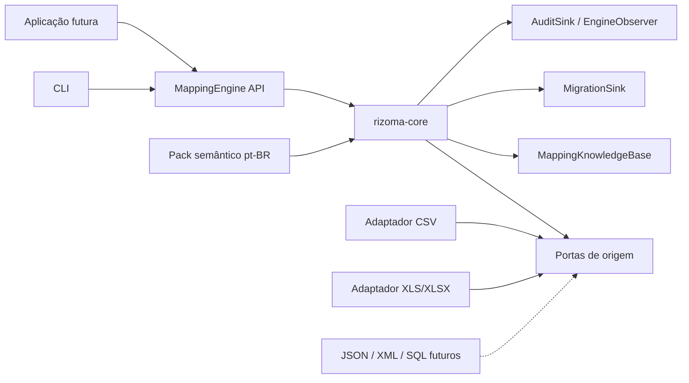
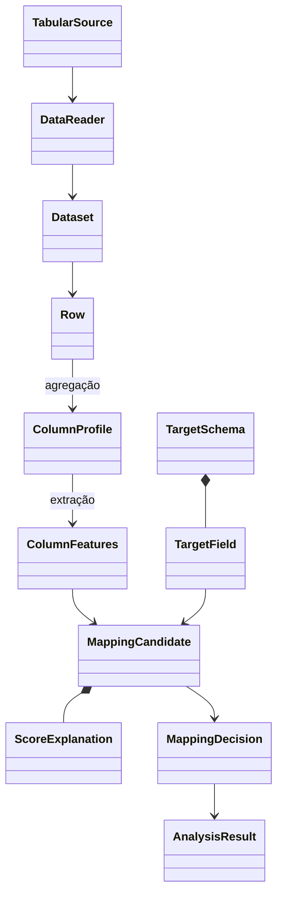
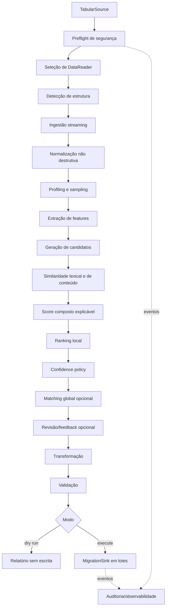

# Rizoma — especificação técnica e arquitetura recomendada

Status: **incrementos 0.1a e 0.1b implementados e verificados localmente; CI remoto pendente**

Data: 2026-09-10

Estado do produto neste workspace: **incrementos 0.1a e 0.1b implementados e
verificados localmente; release publica ainda nao criada**.

## 1. Resumo executivo

Rizoma é um motor Java de ingestão, profiling, mapeamento, validação,
transformação e migração de dados desconhecidos ou parcialmente estruturados
para um esquema conhecido. CSV, XLS e XLSX são os primeiros formatos, não os
limites da arquitetura.

O diferencial não é ler planilhas, mas produzir hipóteses de mapeamento
explicáveis a partir de múltiplas evidências: nomes e aliases, tipo físico,
categoria semântica, padrões, distribuição, restrições do destino e feedback
humano. O núcleo deve funcionar integralmente sem LLM, rede, banco, Spring ou
estado global.

| Item | Estado após esta entrega |
|---|---|
| Especificação, revisão crítica e arquitetura final | **IMPLEMENTADO** |
| Decisões de Java, build, licença e primeiro incremento | **IMPLEMENTADO** |
| Motor, CLI, readers CSV/XLS/XLSX e testes executáveis | **IMPLEMENTADO E VERIFICADO LOCALMENTE** |
| Teste de volume CSV com 1 milhão de registros | **IMPLEMENTADO E VERIFICADO LOCALMENTE** |
| Microbenchmarks JMH | **PLANEJADO / NÃO IMPLEMENTADO** |
| Persistência, REST, Spring, UI, ML e LLM | **PLANEJADO** |

## 2. Problema, objetivos e escopo

Migrações reais combinam metadados ruins, formatos variáveis, valores inválidos
e conhecimento implícito. `Documento` pode significar CPF, CNPJ, passaporte ou
ID interno. Comparar somente cabeçalhos gera falsos positivos; exigir todo o
mapeamento manual não escala.

> Dadas uma fonte observada e uma descrição do destino, encontrar, ordenar e
> explicar correspondências plausíveis entre colunas e campos, preservando
> incerteza, detectando anomalias e respeitando limites de recursos.

### 2.1 Objetivos

1. Ler CSV, XLS e XLSX por adaptadores substituíveis e em fluxo quando possível.
2. Detectar estrutura e normalizar representações sem destruir o valor original.
3. Produzir perfis com proveniência e nível de precisão explícitos.
4. Inferir tipos físicos e categorias semânticas por regras determinísticas.
5. Gerar, pontuar, ranquear e explicar candidatos de mapeamento.
6. Distinguir score, cobertura de evidência, margem e confiança calibrada.
7. Suportar feedback, transformação, validação, dry run e destinos plugáveis.
8. Trabalhar com memória limitada, dados sensíveis protegidos e auditoria
   reproduzível.
9. Entregar uma API Java pequena e uma CLI útil antes de qualquer servidor web.

### 2.2 Não objetivos iniciais

- ser uma plataforma distribuída de ETL, CDC, joins ou lineage corporativo;
- avaliar fórmulas, executar macros ou preservar formatação visual de Excel;
- prometer probabilidade estatística sem conjunto de calibração;
- exigir banco, Spring, REST, UI ou carregamento dinâmico de plugins no MVP;
- introduzir ML, embeddings ou LLM antes de medir o baseline determinístico;
- enviar dados ou credenciais a serviços externos.

## 3. Casos de uso

| ID | Ator | Caso de uso | Resultado |
|---|---|---|---|
| UC-01 | Analista | Analisar fonte desconhecida | Estrutura, perfis, anomalias e amostras mascaradas |
| UC-02 | Integrador | Comparar fonte e esquema | Candidatos ordenados por coluna |
| UC-03 | Analista | Explicar uma sugestão | Métricas, pesos, evidências, limitações e conflitos |
| UC-04 | Analista | Confirmar ou corrigir | Feedback versionado e escopado |
| UC-05 | Operador | Simular migração | Relatório sem escrita no destino |
| UC-06 | Operador | Executar migração | Escrita em lotes por adaptador de destino |
| UC-07 | Desenvolvedor | Adicionar formato ou detector | Extensão sem alterar o pipeline central |
| UC-08 | Auditor | Reproduzir decisão | Versões, hashes, configuração e evidências |

## 4. Requisitos funcionais

| ID | Requisito | Fase |
|---|---|---|
| RF-01 | Detectar formato por conteúdo e metadados; extensão é só evidência | 0.1 |
| RF-02 | Ler CSV, XLS e XLSX, selecionando tabela/planilha | 0.1 |
| RF-03 | Preservar localização de linha e célula | 0.1 |
| RF-04 | Detectar ou receber charset, dialeto, cabeçalho e linha inicial | 0.1 |
| RF-05 | Preservar valor original e gerar normalizações derivadas | 0.1 |
| RF-06 | Calcular perfis incrementais com precisão declarada | 0.1–0.2 |
| RF-07 | Inferir tipos físicos e semânticos com evidência positiva/negativa | 0.1–0.2 |
| RF-08 | Comparar features por métricas determinísticas | 0.1–0.2 |
| RF-09 | Ranquear e explicar todos os componentes do score | 0.1–0.2 |
| RF-10 | Decidir por threshold, margem, cobertura e conflitos | 0.1–0.2 |
| RF-11 | Detectar valores incompatíveis sem expor PII | 0.2 |
| RF-12 | Aplicar transformações e validações componíveis | 0.3 |
| RF-13 | Executar dry run pelo caminho real, sem escrita | 0.3 |
| RF-14 | Registrar feedback em knowledge base opcional | 0.4 |
| RF-15 | Resolver colisões por matching global configurável | 0.5 |
| RF-16 | Emitir auditoria e observabilidade por portas | 0.2–0.3 |
| RF-17 | Exportar relatórios estruturados, inicialmente JSON | 0.1 |

## 5. Requisitos não funcionais

| ID | Requisito verificável |
|---|---|
| RNF-01 | `rizoma-core` compila sem Spring, POI, parser CSV, banco ou rede. |
| RNF-02 | Em streaming, memória cresce com colunas/amostra/limites, não com linhas. |
| RNF-03 | Entrada, esquema, config, seed e versões iguais dão o mesmo ranking. |
| RNF-04 | Sugestão inclui componentes, pesos, cobertura, margem e bloqueios. |
| RNF-05 | PII bruta não entra em logs ou auditoria por padrão. |
| RNF-06 | Readers limitam bytes, linhas, colunas, célula, compactação e tempo. |
| RNF-07 | APIs públicas possuem JavaDoc e SemVer a partir de 1.0. |
| RNF-08 | Core e adaptadores críticos possuem testes unitários, contratuais e integração. |
| RNF-09 | Releases terão SBOM, licenças verificadas, scan e checksums. |
| RNF-10 | Erros têm estágio, código estável e localização segura. |

## 6. Decisões de plataforma e toolchain

### 6.1 Java 21 como baseline

O projeto compilará com `--release 21` e terá matriz de CI em Java 21 e Java
25. Java 25 é o LTS mais novo em setembro de 2026; 21 é escolhido como baseline
de compatibilidade, não como versão mais nova.

- **Performance:** Java 21 possui JIT e GCs maduros e virtual threads. Parsing,
  alocação, streaming e algoritmos terão impacto maior que elevar o bytecode.
- **Manutenção e linguagem:** records, sealed classes, pattern matching de
  `switch` e virtual threads já estão finalizados. O core não usará preview.
- **Ecossistema:** bibliotecas e ambientes corporativos já adotaram 21;
  artefatos Java 21 executam em runtimes Java 25 compatíveis.
- **Compatibilidade corporativa e contribuição:** reduz a exigência para
  organizações e contribuidores ainda no LTS anterior.
- **Longevidade:** Java 21 é LTS com janela comercial publicada até pelo menos
  2031; Java 25 será testado continuamente.
- **Open source:** a especificação não obriga Oracle JDK; distribuições OpenJDK
  como Eclipse Temurin são adequadas.

Elevar o baseline para 25 exigirá ADR e benefício mensurado ou versão major.

### 6.2 Maven 3.9 via Maven Wrapper

Maven foi escolhido por convenção forte, POMs legíveis, publicação simples no
Maven Central, familiaridade corporativa e suporte multimódulo. A flexibilidade
extra do Gradle não traz benefício proporcional ao build inicial. O Wrapper do
0.1a fixa Maven 3.9.16; mudar a linha principal exige decisão explícita.

### 6.3 Apache License 2.0

Apache-2.0 foi adotada no lugar da MIT inicial. Continua permissiva e adiciona
concessão explícita de patentes, relevante para contribuições empresariais. O
texto oficial está em `LICENSE` e a atribuição do projeto em `NOTICE`.

## 7. Arquitetura e módulos

Rizoma usa arquitetura hexagonal leve em um **monólito modular de biblioteca**.
Fronteiras controlam dependências; não exigem framework ou uma classe por etapa.



```text
CSV ---------\       detect -> profile -> features          report JSON
XLS/XLSX -----+----> candidates -> score -> confidence ----> dry run
future -------/      validate -> transform                  future sinks
                             ^          |
                             |          +--> audit events
                      locale packs / optional knowledge
```

| Módulo | Responsabilidade | Dependências permitidas |
|---|---|---|
| `rizoma-core` | Domínio, portas, pipeline, profiling, features, métricas, score, ranking, validação e transformação | JDK no 0.1 |
| `rizoma-format-csv` | Sniffing/dialeto e leitura record-wise | Apache Commons CSV/IO |
| `rizoma-format-excel` | Leitura segura e streaming de XLS/XLSX | Apache POI |
| `rizoma-locale-ptbr` | Aliases e detectores semânticos brasileiros; no 0.1a, CPF e telefone | Core, sem rede |
| `rizoma-cli` | Comandos, configuração, schema/report JSON e composição | Picocli/Jackson/adaptadores |
| `rizoma-benchmarks` | Microbenchmarks fora dos artefatos de produção | JMH, criado só com código mensurável |

Não haverá inicialmente módulos `api`, `spi`, `domain`, `application` ou
`observability`; são pacotes no core até dependência, ciclo ou estabilidade
justificar extração. Diretórios vazios não serão criados.

```text
              +-------------- rizoma-cli --------------+
              |                     |                   |
              v                     v                   v
    rizoma-format-csv   rizoma-format-excel   rizoma-locale-ptbr
              \                     |                   /
               +--------------------+------------------+
                                    v
                              rizoma-core

Core nunca depende de CLI, POI, Commons CSV, banco, Spring ou web.
```

## 8. Modelo de domínio



- `TabularSource`: fonte reabrível de bytes/metadados. O nome evita colisão com
  `javax.sql.DataSource`. Fontes não reabríveis exigem materialização limitada.
- `StructureDetection`: formato, tabela/planilha, header, dialeto, charset,
  alternativas, confiança e evidências; aceita override explícito.
- `Dataset`: cursor lazy, `AutoCloseable` e de passagem única, nunca lista total.
- `Row`: localização de registro/linha física e vetor posicional de strings no
  0.1a, evitando mapa por linha. `CellValue` tipado será introduzido somente
  quando outro formato exigir metadados próprios.
- `ColumnProfile`: agregados, estimativas, amostras e metadados de precisão.
- `ColumnFeatures`: projeção imutável e compacta consumida pelo matching.
- `SemanticTypeId`: id aberto e namespaced (`core:email`, `br:cpf`), não enum.
- `TargetSchema`/`TargetField`: id/versão/contexto/locale, nome, aliases, tipo
  físico, conjunto de tipos semânticos, obrigatoriedade e exclusividade. O 0.1a
  não aceita exemplos ou regras que seriam silenciosamente ignorados.
- `MappingCandidate`: par origem/destino com score e explicação.
- `MappingDecision`: candidato escolhido ou `UNMAPPED`, status e motivos.
- `AnalysisResult`: perfis, rankings, decisões e avisos; não retém o dataset.

Cada medida declara `Accuracy = EXACT | ESTIMATED | SAMPLED | UNAVAILABLE`,
método e tamanho da amostra. Mediana ou cardinalidade estimada nunca é
apresentada como exata.

## 9. Interfaces principais

Os contratos abaixo orientam a arquitetura. As assinaturas concretas do 0.1a
estão no código e em `docs/contracts/JSON_CONTRACTS_0.1A.md`; ainda não há
garantia de compatibilidade binária.

```java
public interface DataReader {
    boolean supports(SourceMetadata metadata);
    StructureDetection detect(TabularSource source, ReadOptions options);
    Dataset open(TabularSource source, StructureDetection structure,
                 ReadOptions options);
}

public interface Dataset extends AutoCloseable {
    DatasetSchema schema();
    Iterator<Row> rows(); // passagem única
}

public interface SimilarityMetric<F> {
    MetricId id();
    double compare(F source, F target);
}

public interface SemanticDetector {
    SemanticTypeId type();
    Accumulator newAccumulator(); // observa valor bruto transitoriamente
}

public interface ScoringStrategy {
    CandidateScore score(ColumnFeatures source, TargetField target,
                         EvidenceBundle evidence, ScoringConfig config);
}

public interface MappingStrategy {
    MappingPlan decide(CandidateMatrix candidates, ConfidencePolicy policy);
}

public interface ValueTransformer<S, T> {
    TransformationResult<T> transform(S value, TransformationContext context);
}

public interface Validator<T> {
    ValidationResult validate(T value, ValidationContext context);
}

public interface MappingKnowledgeBase {
    HistoricalEvidence find(KnowledgeQuery query);
    void record(MappingFeedback feedback);
}
```

Pipeline, candidate generator e threshold policy começam como classes concretas;
só variação externa ou estratégia legítima recebe interface. A knowledge base
nunca grava silenciosamente durante scoring: feedback é operação explícita.

### 9.1 API Java implementada no 0.1a

```java
MappingEngine engine = MappingEngine.builder()
    .readers(readerRegistry)
    .semanticDetectors(detectorRegistry)
    .configuration(configuration)
    .build();

AnalysisResult result = engine.analyze(
    new AnalysisRequest(source, targetSchema, options));
```

Fonte e esquema pertencem à requisição, não ao estado mutável do engine. A
composição é imutável e permite reutilização sequencial. Segurança concorrente
não é prometida porque readers e detectores injetados podem não ser thread-safe.

### 9.2 CLI implementada e comandos futuros

```text
rizoma analyze clientes.csv --schema customer.schema.json --out report.json
rizoma explain report.json --column "CPF Cliente"
```

`map`, `import` e `dry-run` não são anunciados pela CLI no 0.1a. Seleção de
header duplicado requer `--column-id cN`.

`import` só será exposto quando ao menos um destino tiver semântica de falha,
transação e idempotência documentadas.

## 10. Pipeline completo



```text
bytes -> preflight -> detect -> stream rows
      -> bounded profiles + sample -> immutable features
      -> candidates -> metrics -> weighted score + explanation
      -> ranking -> confidence gates -> optional optimizer
      -> mapping plan -> reopen source -> transform -> validate
      -> dry-run OR batch sink -> masked audit summary
```

Reader converte formato, não semântica; normalização preserva original; profiler
agrega; extractor compacta; métrica mede sem decidir; score combina; confidence
aplica suficiência e conflitos; dry run nunca recebe porta de escrita.

## 11. Detecção de estrutura e normalização

CSV considera BOM UTF-8, charset permitido, delimitador, aspas/escape e
consistência do número de células. A detecção 0.1a usa janela limitada e exige
override quando não encontra alternativa confiável; linhas de preâmbulo ficam
fora deste incremento. O limite total de bytes é aplicado durante a leitura. O
limite por campo é verificado quando Commons CSV entrega o token: como o parser
não oferece limite anterior à alocação, um campo hostil ainda pode alocar até o
limite total do arquivo, risco explícito para hardening 0.1b.

Excel detecta a assinatura real OLE2/OOXML, independentemente da extensao. XLSX
usa cursor StAX sobre a worksheet; fontes locais abrem o pacote em modo read-only
e fontes nao locais usam spool temporario limitado e removido. XLS legado usa o
user model HSSF com teto proprio de 20 MiB porque um cursor síncrono sobre o
event model exigiria spool ou uma camada produtora concorrente prematura.

Mais de uma planilha exige selecao por nome exato ou indice. Gaps de celula sao
preenchidos sem perder posicao e linhas guardam o numero fisico. Formulas nunca
sao avaliadas: a politica escolhe cache, expressao ou rejeicao. Datas com estilo
Excel sao convertidas para ISO local; formatos numericos como `000` preservam
zeros de exibicao. Celulas mescladas nao propagam o valor da ancora no 0.1b.
Linhas vazias iniciais sao toleradas ate `maxPreambleRows`; preambulos textuais
nao sao inferidos e exigem que a origem seja ajustada. O preview examina no
maximo 1.000 registros fisicos e reabre a fonte para o profiling.

O preflight OOXML limita entradas, bytes expandidos totais/por entrada e razao
de compressao, rejeita path traversal, symlinks, entradas ilegíveis, macros e
relacionamentos externos. DTD e entidades XML externas ficam desabilitados.
`ReadOnlySharedStringsTable` ainda materializa strings unicas; o risco e contido
indiretamente pelo limite da entrada `sharedStrings.xml`, nao eliminado.

Header usa proporção de texto não vazio, unicidade dos nomes e compatibilidade
com tipos das linhas seguintes. `maxPreambleRows` limita a busca.

### 11.1 Nomes de coluna

1. Unicode NFKC;
2. trim e colapso de espaços;
3. separação de camel/Pascal case e transições alfanuméricas;
4. case folding com `Locale.ROOT`;
5. forma sem diacríticos, preservando a forma anterior;
6. tokenização de pontuação, `_` e `-`;
7. expansão de abreviações por dicionário versionado e escopado;
8. formas tokens, `snake_case` e compacta para métricas diferentes.

Stop words ficam desligadas por padrão: remover `cliente` pode apagar contexto.

```text
"  dtNascimento "
-> tokens=["dt", "nascimento"]
-> expanded=["data", "nascimento"]  (pack pt-BR)
-> snake="data_nascimento"
-> compact="datanascimento"
```

### 11.2 Valores

- CPF/CEP/telefone: forma canônica e validação separada; shape não prova validade;
- CNPJ: preservar letras e dígitos significativos. O formato alfanumérico entrou
  em produção em 2026; o detector completo permanece fora do 0.1a;
- e-mail: trim, sintaxe e domínio lowercase; local-part não é destruída;
- datas: lista ordenada de formatos e locale; `01/02/2026` pode ficar ambígua;
- moeda/percentual/número: separadores por locale e `BigDecimal`, não `double`;
- booleano: vocabulário configurável (`sim/não`, `yes/no`, `1/0`);
- texto: Unicode/espaços; sanitização para exportar é etapa distinta.

`NormalizedValue` registra regra, sucesso, ambiguidade e possível perda.

## 12. Data profiling, features e anomalias

`ColumnProfile` pode conter:

- nome original, representações normalizadas e posição;
- total, ausentes, inválidos e não vazios;
- distintos/estimativa e razão de unicidade;
- comprimentos mínimo, máximo, média e histograma limitado;
- tipo físico por votos e razão de mistura;
- média, variância/desvio incremental por Welford, mínimo e máximo;
- quantis/mediana estimados quando houver sketch;
- padrões e regex dominantes com contadores limitados;
- top-K/frequency sketch, entropia e evidências semânticas;
- amostra representativa mascarada;
- localizações limitadas de anomalias, mas contagem total;
- accuracy, método, N e warnings por medida.

`ColumnFeatures` leva somente dados necessários ao matching:

```text
normalizedName, nameTokens, aliases
physicalTypeVotes, semanticEvidence
lengthHistogram, numericSummary, nullRatio, uniqueRatio
dominantPatterns, boundedTokenFrequency
maskedSamples, sampleSize, evidenceReliability
```

No 0.1a, os detectores genéricos implementados são e-mail e data, além dos votos
de tipo físico. O pack pt-BR implementa CPF com checksum e telefone
conservador. CNPJ, CEP, UUID, URL, percentual, moeda e categorias como pessoa ou
endereço permanecem planejados. CPF diferencia `shapeMatchRatio` de
`checksumValidRatio`; onze dígitos sem formatação são ambíguos para telefone.

Anomalias incluem tipo/padrão/comprimento raro, mistura de tipos, outlier
robusto, nulidade/duplicidade incompatível, fórmula, conteúdo perigoso e linha
irregular. O relatório guarda localização e valor mascarado; valor bruto exige
opt-in explícito.

## 13. Feature extraction e candidate generation

O extractor transforma perfis pesados em features imutáveis com proveniência.
Para esquemas pequenos, avaliam-se todos os `C*T` pares. Para esquemas grandes,
índices por tipo, semântica e tokens formam uma shortlist, mas:

- existe sempre o candidato `UNMAPPED`;
- alias exato nunca é podado;
- incompatibilidade forte só exclui com explicação;
- `topK` é configurável e o relatório registra a poda.

Depois do profiling, a geração custa `O(C*T)` antes do custo das métricas e não
depende do número de linhas.

## 14. Similaridade e fundamentos matemáticos

Todas as métricas devolvem `[0,1]`, detalhes e condições degeneradas. Ambas as
entradas passam pela mesma versão do normalizador.

### 14.1 Dice

```text
Dice(A,B) = 2 * |A ∩ B| / (|A| + |B|)
```

Para `{data,nasc}` e `{data,nascimento}`, a interseção tem tamanho 1 e Dice é
`2/4 = 0,50`. É útil em tokens e n-gramas, dá mais peso à sobreposição que
Jaccard e custa `O(|A|+|B|)` com hash sets. Em strings curtas, um bigrama muda
muito o resultado; em longas, ignora ordem global e, com conjuntos, repetição.
Vazio/vazio só é igualdade quando a política permitir.

### 14.2 Jaccard

```text
J(A,B) = |A ∩ B| / |A ∪ B|
```

No exemplo anterior, `J = 1/3 = 0,333`. É intuitivo para tokens e aliases,
penaliza extras mais que Dice e tem custo linear. Perde frequência e ordem.
Jaccard e Dice sobre os mesmos tokens são correlacionados e não devem receber
pesos altos independentes no score final.

### 14.3 Levenshtein e versão normalizada

```text
d(i,0)=i; d(0,j)=j
d(i,j)=min(d(i-1,j)+1,
           d(i,j-1)+1,
           d(i-1,j-1)+[a_i != b_j])
L(a,b)=1-d(a,b)/max(|a|,|b|)
```

`kitten -> sitting` tem distância 3 e `L = 1-3/7 = 0,571`. É adequado a
typos e nomes compactos, mas custa `O(m*n)` tempo e `O(min(m,n))` memória com
duas linhas. Uma edição pesa muito em strings curtas; palavras reordenadas ficam
artificialmente distantes. Limites e pré-filtros evitam trabalho quadrático.

### 14.4 Jaro e Jaro-Winkler

Se `m` é a quantidade de caracteres correspondentes dentro da janela
`floor(max(|s1|,|s2|)/2)-1` e `t` metade das transposições:

```text
Jaro = (m/|s1| + m/|s2| + (m-t)/m) / 3
JW = Jaro + l * p * (1-Jaro)
```

`l` é o prefixo comum, limitado normalmente a 4, e `p <= 0,1`. Para
`MARTHA/MARHTA`, Jaro é aproximadamente `0,944` e Jaro-Winkler `0,961`.
Funcionam bem para transposições e pequenos typos; Winkler pode supervalorizar
prefixos genéricos como `cliente_`. Na implementação direta que busca uma
janela para cada caractere, o pior caso é `O(m*n)`. Como a métrica ainda não foi
implementada, não se promete custo linear; documentação e benchmark deverão
corresponder ao algoritmo concreto adotado na fase posterior.

### 14.5 Cosine

```text
cos(x,y) = (x · y) / (||x||2 * ||y||2)
```

Com `x=(1,1,0)` e `y=(1,0,1)`, o produto é 1, ambas as normas são `sqrt(2)` e
o resultado é `0,5`. É útil em frequências de tokens, n-gramas e distribuições;
preserva frequência, mas ignora ordem. Termos comuns podem dominar sem
ponderação. Vetor zero resulta em `UNAVAILABLE`, não em zero.

### 14.6 N-gramas

Bigramas de `nome` são `{no,om,me}`. Dice, Jaccard ou Cosine são aplicados às
janelas. N-gramas toleram ruído local e custam `O(L)` para extração. `n` grande
falha em strings curtas; `n` pequeno aumenta colisões. O baseline posterior usa
trigramas com bordas somente quando houver comprimento suficiente.

### 14.7 Entropia

```text
H(X) = -Σ p_i * log2(p_i)
```

Frequências `(0,5; 0,25; 0,25)` produzem `1,5` bits. Baixa entropia sugere
enum/booleano; alta entropia combinada a alta unicidade pode sugerir ID. Não
detecta semântica isoladamente e será estimada em dados grandes.

### 14.8 Probabilidade e confidence

Score heurístico não é probabilidade. Uma saída `0,92` só poderá significar
“92% de chance” após calibração em corpus rotulado independente e teste de
confiabilidade por faixa. Antes disso, a API usa **confidence index** com
`calibration=UNCALIBRATED`.

## 15. Content similarity, scoring e ranking

`ContentSimilarityMetrics` compara tipo físico, categoria semântica, regex/
shape, comprimento, domínio, frequência, cardinalidade e distribuição. Cada
evidência inclui score, confiabilidade, cobertura, amostra e explicação.

### 15.1 Pesos iniciais

| Evidência | Peso | Justificativa |
|---|---:|---|
| lexical | 0,30 | nome ajuda, mas frequentemente é ruim |
| semântica | 0,30 | conteúdo resolve cabeçalhos ambíguos |
| tipo físico | 0,10 | evita conversões, mas texto é comum |
| padrão/formato | 0,15 | regex, comprimento e shape complementam semântica |
| distribuição | 0,05 | só existe com perfil/exemplos do destino |
| histórico confirmado | 0,10 | ajuda sem dominar evidência atual |

Esses pesos são hipótese transparente e configurável, não verdade estatística.
Com similaridade `s_i`, peso `w_i` e confiabilidade/disponibilidade `q_i`:

```text
score = Σ(w_i*q_i*s_i) / Σ(w_i*q_i)
coverage = Σ(w_i*q_i) / Σ(w_i)
confidenceIndex = score * coverage * (1-contradictionPenalty)
```

Renormalização evita punir score por evidência indisponível; `coverage` impede
que um único sinal alto pareça suficiente. Métricas correlacionadas formam um
subscore lexical em vez de votos independentes.

No 0.1a, Dice e Levenshtein normalizado são agregados em um único componente
lexical correlacionado. Distribuição e histórico aparecem como indisponíveis,
com contribuição zero e motivo, nunca com valores sintéticos. A explicação
lista as duas métricas, evidência semântica/shape, N, peso, confiabilidade,
contribuição, limitações e versão de configuração. Métricas futuras não são
listadas como se tivessem participado.

### 15.2 Política de confiança

| Condição mínima | Status |
|---|---|
| `score >= 0,90`, `margin >= 0,15`, `coverage >= 0,60`, sem conflito | `AUTO_MAP` |
| `score >= 0,70` e evidência suficiente | `REVIEW_RECOMMENDED` |
| `score >= 0,50` | `LOW_CONFIDENCE` |
| demais casos | `NO_MATCH` |

`margin = bestScore-secondBestScore` entre candidatos elegíveis, antes do corte
top-K do relatório. Com um único candidato elegível, margem é indisponível e
bloqueia automação. Antes de calibração, `AUTO_MAP` fica desligado por padrão no
próprio core. Contradições fortes incluem semântica incompatível ou colisão em
destino exclusivo; constraints de importação ainda não são executadas.

## 16. Matching global

One-to-one pode ser modelado como assignment bipartido ponderado. Hungarian
resolve em `O(n^3)`, com nós fictícios para `UNMAPPED`. Só faz sentido quando
exclusividade é verdadeira e os scores locais são confiáveis.

Será adiado porque campos compostos e duplicações quebram one-to-one; maximizar
a soma pode aceitar vários pares medíocres; poda pode remover o ótimo; e um
otimizador não corrige score ruim. Na 0.5 coexistirão `LocalMappingStrategy` e
`BipartiteMappingStrategy` opt-in, com constraints, mappings fixos,
`UNMAPPED` e desempate determinístico.

## 17. Feedback e aprendizagem progressiva

`MappingKnowledgeBase` registra eventos, não apenas o último estado. Chave:

```text
schemaId + schemaVersion/fingerprint + targetFieldId
+ normalizedSourceName + locale + optional domain/context
```

Evidências guardam confirmações, rejeições, versão/recência e proveniência. Não
misturam organizações por padrão. Histórico tem peso limitado e nunca substitui
conteúdo atual. Implementações previstas: no-op e memória para testes; arquivo
depois; JDBC/serviço somente sob demanda. O core funciona sem persistência.

## 18. Transformação, validação, dry run e migração

```text
raw CellValue -> normalize -> ValueTransformer(s)
              -> Validator(s) -> RowValidationResult
              -> dry-run counters OR MigrationSink batch
```

Transformações básicas incluem texto para data, inteiro, `BigDecimal`, booleano
e normalizações CPF/CNPJ/telefone/CEP. Resultados tipados registram erros e
conversões com perda. Políticas: `FAIL_FAST`, `SKIP_ROW`, `COLLECT_ERRORS`, com
limite máximo de erros.

Validadores cobrem required, regex, range, enum, unicidade, foreign key por
porta e regra customizada. Unique/FK globais declaram custo e consistência; não
usam `Set` ilimitado escondido.

Dry run reabre a fonte e percorre o mesmo caminho de transformação/validação,
mas usa `NoWriteExecutionMode`, nunca um sink descartável. O relatório inclui
processadas, válidas, inválidas, warnings, erros e exemplos mascarados.

`MigrationSink` declara transação, rollback, idempotência, upsert e batch
máximo. O engine não promete exactly-once genericamente. Falha parcial registra
o último lote confirmado e estado terminal auditável.

Um plano futuro de execução deve ficar vinculado ao fingerprint do conteúdo de
origem, à versão/fingerprint do schema e à versão da configuração analisada.
Alteração relevante invalida o plano ou exige nova análise. O 0.1a registra
essas identidades em `AnalysisResult`, mas não implementa snapshot ou migração.

## 19. Performance, streaming e sampling

Com `R` linhas, `C` colunas, `T` campos, amostra `K` e top-values `V`:

| Operação | Tempo | Memória alvo |
|---|---:|---:|
| leitura e profiling | `O(R*C)` | `O(C*(K+V+buckets))` |
| normalização | `O(total de caracteres)` | por linha ou lote |
| candidatos | `O(C*T*M)` | `O(C*topK)` após ranking |
| Levenshtein por par | `O(m*n)` | `O(min(m,n))` |
| token/n-gram | linear nas unidades | linear na string limitada |
| Hungarian futuro | `O(max(C,T)^3)` | `O(C*T)` |

O primeiro incremento será sequencial. Paralelismo prematuro complica ordem,
cancelamento e heap. Após benchmarks, parsing poderá alimentar lotes por fila de
capacidade fixa; CPU usará pool limitado e I/O de destinos poderá usar virtual
threads. Backpressure é obrigatória.

### 19.1 Sampling

| Estratégia | Vantagem | Limitação | Uso |
|---|---|---|---|
| first N | rápida e determinística | viés de ordenação | preview, nunca alta confiança isolada |
| random seekable | uniforme | acesso aleatório ou duas passagens | fontes seekable |
| reservoir | uniforme, uma passagem, `O(K)` | lê tudo e pode perder raros | baseline em full scan |
| stratified | preserva grupos | exige estrato e estado | posterior |

Estatísticas baratas percorrem todas as linhas; detectores caros e amostras usam
reservoir com seed registrada. First N marca `SAMPLED_BIASED`. Reservoir reduz
memória e computação cara, não I/O.

Para grandes volumes:

- cardinalidade migra para HyperLogLog/sketch após limite configurado;
- frequências usam top-K/Space-Saving ou equivalente;
- quantis usam sketch/t-digest quando introduzido e testado;
- strings, exemplos e erros têm limites, preservando contagens totais;
- segunda passagem ocorre apenas para dry run/import;
- datasets de 1M/10M linhas são gerados nos testes, não commitados.

## 20. Segurança e privacidade

| Ameaça | Controle |
|---|---|
| arquivo gigante | limite de bytes antes/durante leitura, linhas, colunas e célula |
| ZIP bomb XLSX | razão compactada, tamanho expandido e número de entradas |
| XML externo | DTD e entidades externas desabilitados |
| arquivo malformado | time/cancellation budget e erro tipado |
| macro/fórmula | macro fora do MVP; fórmula nunca avaliada |
| CSV/formula injection | marcar `=`, `+`, `-`, `@`; escapar ao exportar, preservar input |
| path traversal | paths permitidos; nenhuma extração livre |
| exaustão de heap | streaming e coleções limitadas |
| PII em logs | masker por tipo, amostra opt-in, fingerprint seguro |
| exfiltração | core sem rede; connector externo sempre explícito |
| supply chain | updates, SBOM, scanner, checksums e assinatura quando possível |

Defaults falham de forma segura. Relaxar limite gera warning no relatório e na
auditoria.

## 21. Auditoria e observabilidade

`AuditSink` recebe eventos com run id, tempos, fingerprint da fonte, versões de
schema/config/software, estrutura, perfis seguros, candidatos, decisões,
feedback, transformações, contagens e estado terminal. Eventos de linha são
limitados e mascarados; configuração sensível não entra em texto claro.

O core emite `EngineEvent` para `EngineObserver`; adaptadores futuros convertem
para SLF4J, Micrometer ou OpenTelemetry. Assim o core não impõe stack.

Métricas previstas:

```text
rizoma.rows.processed
rizoma.rows.invalid
rizoma.stage.duration
rizoma.mapping.score
rizoma.mapping.status
rizoma.mapping.failures
rizoma.source.bytes
rizoma.profile.sample.size
```

Labels não contêm PII, path, nome bruto de coluna ou alta cardinalidade. Tracing
cobre estágios/lotes, nunca uma span por célula.

## 22. Estratégia de testes e benchmarks

- **Unitários:** normalizadores, detectores, acumuladores, métricas, score,
  confidence e limites.
- **Property-based:** simetria/limites de métricas, idempotência, reservoir,
  determinismo e ausência de NaN.
- **Contrato:** cada reader, detector, sink e knowledge base passa por suite
  compartilhada.
- **Integração:** CSV/XLS/XLSX mínimos, encodings, gaps, datas, fórmulas e
  arquivos malformados.
- **Golden corpus:** schemas/datasets anonimizados com top-1/top-3, precision,
  recall e auto-map incorreto.
- **Segurança/fuzz:** ZIP/XML/CSV hostil, dimensões excessivas e cancelamento.
- **Sistema:** 100 mil, 1 milhão e 10 milhões de linhas geradas, heap limitado.
- **Compatibilidade:** Java 21/25 e sistemas principais, proporcional ao risco.
- **Mutação:** posterior em score, detectores e validadores críticos.

Gate inicial do core: pelo menos 85% de linhas e 80% de branches, sem confundir
cobertura com qualidade. Todo bug recebe teste de regressão; fixtures não usam
PII real.

Qualidade do mapping mede accuracy top-1, recall top-3, precision do `AUTO_MAP`
(prioritária), coverage por status, matriz de confusão semântica e calibration
error quando aplicável.

JMH medirá Dice, Jaccard, Levenshtein, Jaro/Winkler, cosine/n-gram, profiling,
candidate generation e scoring. I/O end-to-end fica separado. Resultados
registram hardware, JDK, GC, heap e forks. O módulo nasce só quando houver
implementação mensurável.

## 23. Riscos técnicos

| Risco | Impacto | Mitigação |
|---|---|---|
| score parecer probabilidade | automação indevida | confidence index, calibration flag, auto-map off |
| sinais correlacionados | score inflado | subscores, ablation tests e calibração |
| profiling ilimitado | OOM | sketches, top-K, reservoir e accuracy explícita |
| readers divergirem | resultados diferentes | suite contratual e golden fixtures |
| header/dialeto errado | pipeline contaminado | alternativas explicadas e override |
| data/decimal ambíguo | corrupção silenciosa | locale explícito; ambiguidade vira review |
| regras BR no core | manutenção ruim | pack namespaced separado |
| API prematura | compatibilidade cara | experimental em 0.x; estável em 1.0 |
| Hungarian inadequado | mappings perdidos | opt-in tardio e constraints |
| histórico transferir viés/PII | falso positivo/vazamento | isolamento e peso limitado |
| concorrência prematura | heap/nondeterminismo | baseline sequencial e benchmark |
| fórmulas/PII vazarem | risco de segurança | não avaliar, mascarar e limitar |
| abstrações excessivas | difícil contribuir | classes concretas sem variação real |

## 24. Estrutura inicial do repositório

```text
rizoma/
├── .github/workflows/ci.yml
├── pom.xml
├── mvnw, mvnw.cmd, .mvn/wrapper/
├── LICENSE, NOTICE, README.md
├── docs/
│   ├── architecture/TECHNICAL_SPECIFICATION.md
│   ├── contracts/JSON_CONTRACTS_0.1A.md
│   ├── memory-bank/{CURRENT,DECISIONS,LEARNINGS}.md
│   ├── testing/CORPUS_0.1A.md
│   └── roadmap.md
├── examples/
├── scripts/volume-smoke.sh
├── rizoma-core/
├── rizoma-format-csv/
├── rizoma-locale-ptbr/
└── rizoma-cli/
```

Módulos serão criados quando receberem ao menos uma classe funcional e testes,
nunca como cascas vazias. Documentos comunitários restantes e módulos Excel/
benchmarks serão adicionados nos incrementos que lhes derem conteúdo real.

## 25. Primeiro incremento vertical e critérios de aceite

### 25.1 Incremento 0.1a — análise CSV explicável

```text
CSV + target schema JSON
 -> detect/stream/profile
 -> normalização genérica + pt-BR
 -> tipo físico + CPF/e-mail/telefone/data
 -> Dice + Levenshtein normalizado
 -> score/ranking/confidence
 -> report JSON + explain na CLI
```

Critérios de aceite:

1. `./mvnw verify` compila em Java 21 e todos os testes passam.
2. Fixture do enunciado põe os sete mappings em top-1; `Documento` com maioria
   de CPFs válidos ranqueia CPF acima de telefone e nome.
3. Coluna ambígua não é auto-mapeada e mostra dois candidatos e margem.
4. CSV gerado de 1 milhão de linhas roda com `-Xmx256m` sem materializar tudo;
   tempo e pico são registrados, sem gate absoluto não portátil.
5. Mesma seed/configuração gera relatório semanticamente idêntico.
6. Acentos, camelCase, snake_case, abreviação `dt` e valores parcialmente
   inválidos possuem testes.
7. Amostras e erros são mascarados; limites de bytes/linhas/colunas/célula são
   testados.
8. README contém quickstart executado no CI e `CURRENT.md` reflete o estado.
9. A API funciona sem inicializar CLI/servidor; CLI e biblioteca produzem as
   mesmas decisões sem duplicar regras.
10. O core mede no mínimo 85% de linhas e 80% de branches, sem exclusões
    artificiais, e não produz NaN/infinito.
11. Java 21 e 25 executam `verify`, sempre compilando com `--release 21`; a
    execução local e a execução do CI são reportadas separadamente.
12. Headers duplicados exigem identidade/posição; recursos fecham também em
    falha; relatórios e mensagens não expõem células brutas por padrão.
13. O teste de volume confirma `rowsProcessed` e resultado não vazio, aplica
    `-Xmx256m` à JVM do motor e distingue RSS de heap.

### 25.2 Incremento 0.1b — Excel e candidata a release 0.1

Adiciona XLS/XLSX pelo mesmo contrato, streaming StAX em XLSX, seleção de
planilha, datas, gaps, fórmulas e limites ZIP. CSV/XLS/XLSX passam pela mesma
suite de mapeamento. Criar tag, publicar artefatos ou anunciar release permanece
uma acao externa separada e exige autorizacao explicita.

## 26. Roadmap

| Versão | Entrega verificável |
|---|---|
| 0.1a | Vertical CSV com profiling, normalização, detectores, ranking e explain |
| 0.1b | XLS/XLSX, segurança e paridade; prepara candidata a release 0.1 |
| 0.2 | Métricas restantes, perfis avançados, anomalias, eventos e corpus |
| 0.3 | Transformação, validação, dry run e sink de arquivo seguro |
| 0.4 | Feedback e knowledge base em memória/arquivo |
| 0.5 | Matching bipartido opt-in comparado ao ranking local |
| 0.6 | SPI documentada, fontes sob demanda e adapters de observabilidade |
| 0.9 | API candidate, hardening e benchmarks publicados |
| 1.0 | API estável, release/SBOM, documentação e qualidade publicadas |

Spring, REST e web não têm versão prometida. ML/LLM/embeddings exigem RFC,
avaliação objetiva, política de privacidade e fallback determinístico.

## 27. Revisão crítica

### 27.1 Contradições resolvidas

1. **Três formatos na primeira versão versus incremento mínimo:** 0.1a entrega
   CSV funcional; 0.1b completa Excel; só a soma vira release 0.1.
2. **Confidence numérica sem calibração:** score, coverage, margin e calibration
   são separados; heurística não é chamada de probabilidade.
3. **Perfil completo versus heap limitado:** cada medida declara precisão e
   medianas/distintos/frequências usam estimativas limitadas.
4. **Pipeline extenso versus interfaces inúteis:** etapas são responsabilidades;
   interface só onde há variação legítima.
5. **Normalização versus auditoria:** original e regra/versão são preservados.
6. **One-to-one versus campos compostos:** optimizer é opt-in e tardio;
   `UNMAPPED` e ranking local permanecem.
7. **Core puro versus observabilidade:** eventos são emitidos sem stack imposto.
8. **Aprendizagem versus privacidade:** histórico é isolado e gravação explícita.

### 27.2 Complexidade removida ou adiada

Não há microserviços, Spring, banco, broker, DAG genérico, módulos por camada,
paralelismo prematuro, Hungarian prematuro, DSL própria, dynamic plugins, ML ou
LLM. Cada um precisa de caso real e evidência.

### 27.3 Hipóteses a validar na implementação

- qualidade da detecção de header/dialeto e regras semânticas;
- paridade e consumo dos event models HSSF/XSSF;
- escolha e erro dos sketches;
- pesos e thresholds após corpus rotulado;
- limites seguros padrão;
- custo de Unicode/métricas e benefício de pruning/concorrência.

Cada hipótese deve gerar teste, benchmark ou ADR antes de virar alegação.

## 28. Recomendação consolidada

Implementar o monólito modular Java 21 com core determinístico e adaptadores. O
primeiro executável é uma CLI de análise. Dataset é cursor streaming; perfis têm
estruturas limitadas; scores carregam explicações; auto-map é conservador e
desligado até calibração. Essa forma entrega fluxo real sem deixar a ambição
futura impor complexidade presente.

## 29. Referências primárias

- [Oracle Java SE Support Roadmap](https://www.oracle.com/java/technologies/java-se-support-roadmap.html)
- [OpenJDK JEP 444 — Virtual Threads](https://openjdk.org/jeps/444)
- [Apache Maven release history](https://maven.apache.org/docs/history)
- [Apache Commons CSV](https://commons.apache.org/proper/commons-csv/)
- [Apache POI Spreadsheet APIs](https://poi.apache.org/components/spreadsheet/)
- [Apache POI event-model HOWTO](https://poi.apache.org/components/spreadsheet/how-to.html)
- [Apache License 2.0](https://www.apache.org/licenses/LICENSE-2.0)
- [Receita Federal — CNPJ Alfanumérico](https://www.gov.br/receitafederal/pt-br/acesso-a-informacao/acoes-e-programas/programas-e-atividades/cnpj-alfanumerico)
- [Receita Federal — documentos técnicos do CNPJ](https://www.gov.br/receitafederal/pt-br/centrais-de-conteudo/publicacoes/documentos-tecnicos/cnpj)
